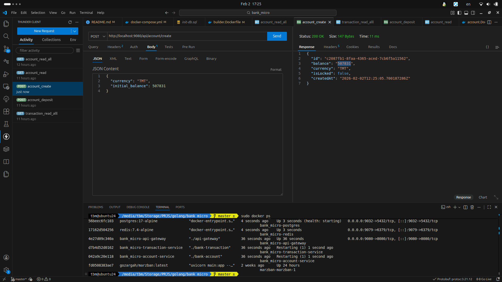
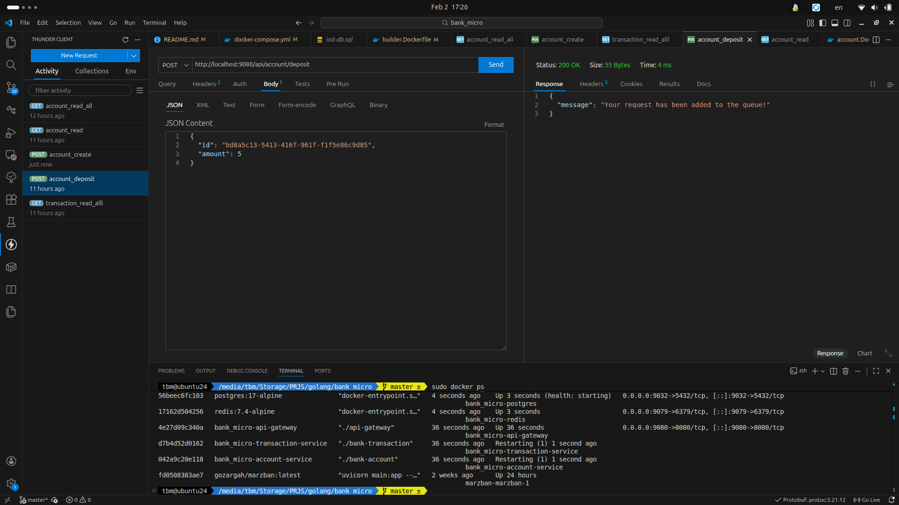
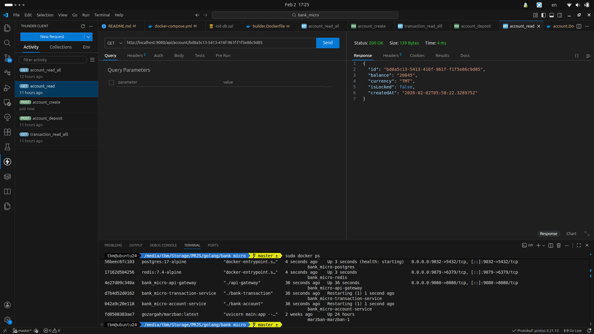
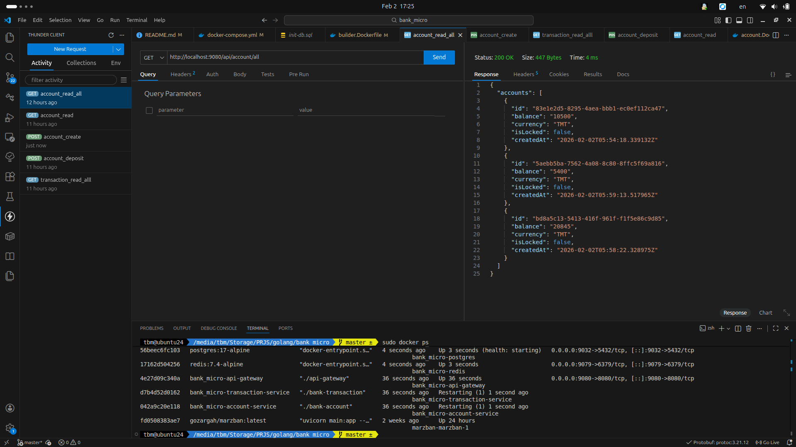
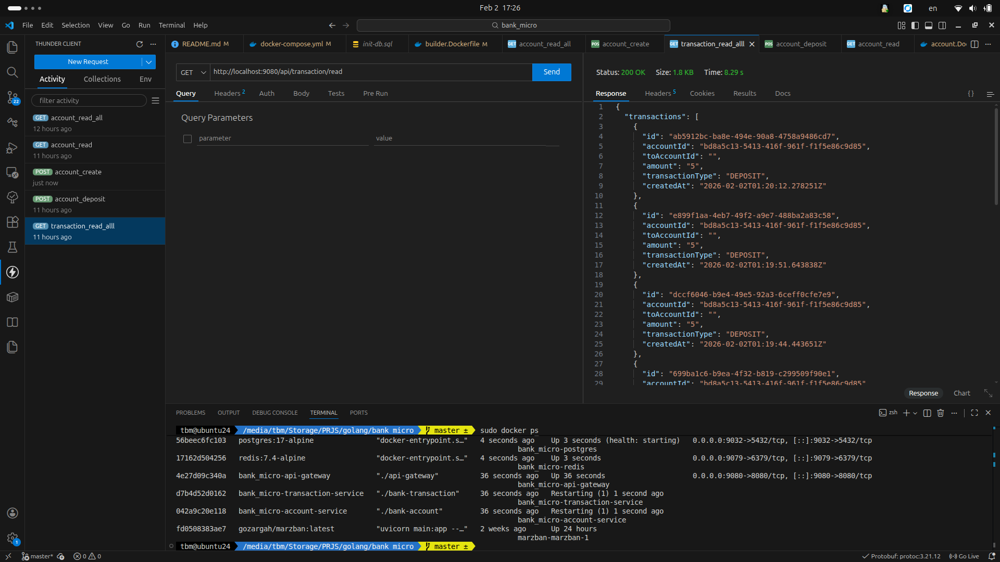

# 🏦 Bank Microservices System (Go + gRPC + RabbitMQ + Docker)

> 🚀 A clean, production-style **banking microservices architecture** built with **Go**, **gRPC**, **RabbitMQ**, **PostgreSQL**, **Redis**, **Buf**, and **Docker Compose**.

This project demonstrates **real-world microservice patterns**:

- Async transaction processing
- gRPC internal communication
- REST API Gateway
- Docker-based tooling & environments
- Clean Architecture & separation of concerns

---

# ✨ Architecture Overview

🔹 **API Gateway (REST)**  
🔹 **Account Service (gRPC)**  
🔹 **Transaction Service (gRPC + Worker)**  
🔹 **RabbitMQ** for async events  
🔹 **PostgreSQL** for persistence  
🔹 **Redis** for caching  
🔹 **Buf** for protobuf & code generation

> gRPC services communicate **inside Docker’s internal network**  
> External access is **ONLY via REST Gateway**

---

# 📂 Project File Structure

````text
.
├── buf.gen.yaml
├── buf.lock
├── buf.yaml
├── docker
│   ├── account.Dockerfile
│   ├── api-gateway.Dockerfile
│   ├── builder.Dockerfile
│   ├── proto.Dockerfile
│   └── transaction.Dockerfile
├── docker-compose.yml
├── gateway
│   └── cmd/main.go
├── pkg
│   ├── database
│   ├── redis
│   └── rabbitmq
├── proto
│   ├── account_service.proto
│   ├── transaction_service.proto
│   └── gen/
├── services
│   ├── account
│   └── transaction
├── init-db.sql
├── screenshots
└── README.md
````
---
---

# 🛠️ Prerequisites

- 🐳 Docker & Docker Compose

- 🟢 Go ≥ 1.25.6 (only for local run)

- 📦 Buf (inside container, no local install needed)

---
--- 

# ⚠️ IMPORTANT ENV SETUP

> #### 1️⃣ Update .env

- Change LOCAL_VOLUME_PATH to your full local path:

```bash
LOCAL_VOLUME_PATH=/home/your-user/docker-composes
```

---

> #### 2️⃣ Prepare Volume Directories
```bash
sudo mkdir -p ~/docker-composes/bank_micro/postgres_data
sudo cp ./init-db.sql ~/docker-composes/bank_micro/init-db.sql
```

# 🧱 Build Docker Images (ONE TIME)
## 🔹 Build Proto Tooling Image
```bash
 sudo docker compose --profile tools build
```

## 🔹 Build Go Microservice Builder Image
```bash
sudo docker compose --profile builder build
```

## 🧬 Protobuf & gRPC Code Generation
Whenever .proto files change:
```bash
sudo docker compose run --rm proto-gen dep update
sudo docker compose run --rm proto-gen
```
---
---
# 🚀 Run the System (Docker)
## 🧱 Start Infrastructure (DB, Redis, RabbitMQ)
```bash
sudo docker compose --profile infra up -d
```

## ⚙️ Build & Run All Microservices
```bash
sudo docker compose --profile runtime up -d
```

# ✅ You are good to go!


# 🌐 API Access
## 🔸 REST API (Gateway)
```bash
http://localhost:9080
```

## 📌 Endpoints & schemas are defined in:
````text
proto/account_service.proto
proto/transaction_service.proto
````

## ⚠️ gRPC Access Note (IMPORTANT)

>## If services are running inside Docker:

- ❌ gRPC endpoints are NOT accessible externally

- ✅ gRPC works only inside Docker network

- 🧪 Run Services Locally (gRPC Enabled)

---
---
>## If you want direct gRPC access, run services locally:

- ## API Gateway
```bash
go run gateway/cmd/main.go
```
- ## Account Service
```bash
go run services/account/cmd/main.go
```
- ## Transaction Service
```bash
go run services/transaction/cmd/main.go
```

## 📌 Run each command in a separate terminal

---
---
# 📸 Screenshots (Request Examples)


| Create Account | Deposit Money | Read Account |
|----------------|---------------|--------------|
|  |  |  |

| Read All Accounts | Read Transactions |  |
|------------------|-----------------|--|
|  |  |  |

---
---
# 🐰 RabbitMQ Admin Panel
```bash
http://localhost:15672
```

Default credentials (if not changed):
user: guest
pass: guest
---
---

# 🧹 Shutdown & Cleanup
## 🔻 Stop Runtime Services
```bash
sudo docker compose --profile runtime down
```
## 🗑️ Remove Runtime Images
```bash
sudo docker compose --profile runtime down --rmi all
```
---
---

# 💡 Key Highlights

- ✅ Clean Architecture
- ✅ Async Transaction Processing
- ✅ gRPC Internal Communication
- ✅ REST API Gateway
- ✅ Docker Profiles (tools / builder / infra / runtime)
- ✅ Production-like Structure

#### ⭐ If You Like This Project

#### Give it a ⭐ on GitHub and feel free to fork & extend it!


<font color="gold" size=6> Happy coding! 🚀 </font>


